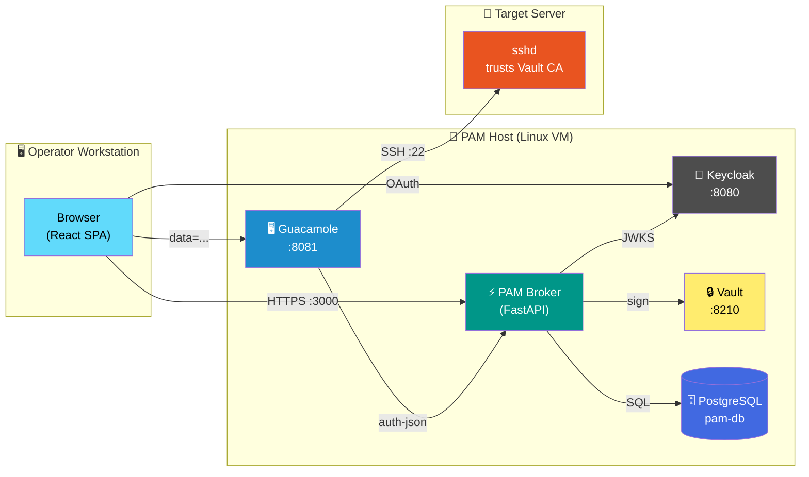
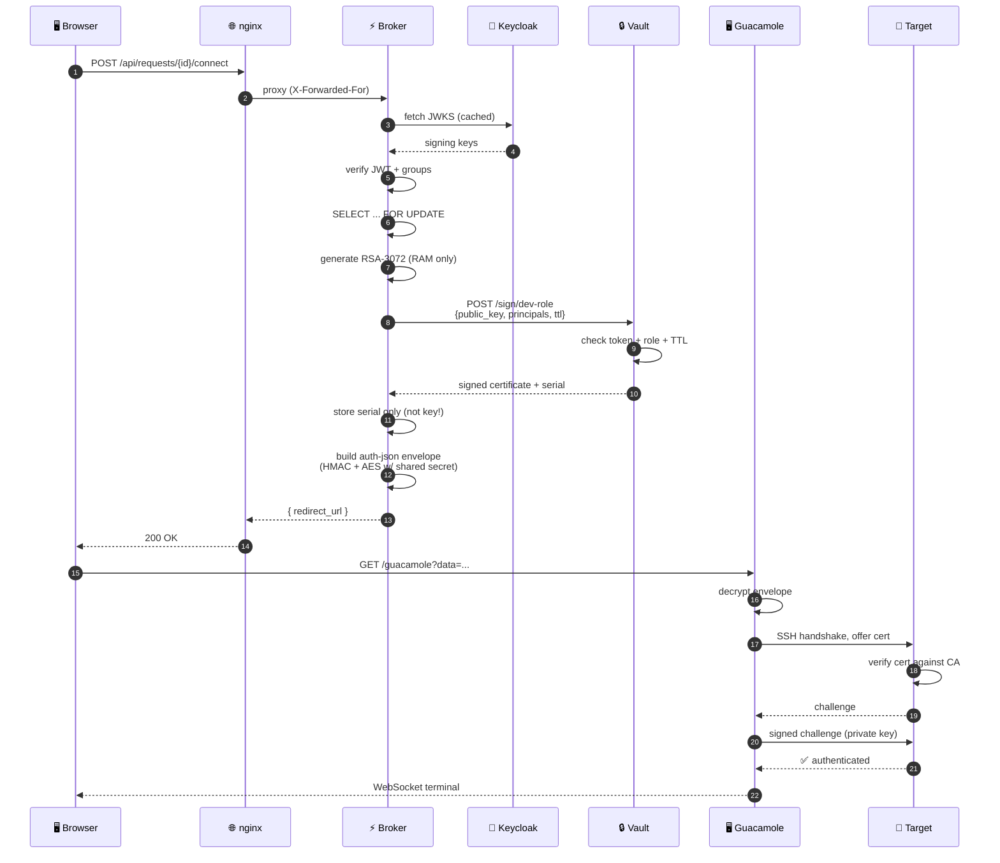

[jit_pam_readme.md](https://github.com/user-attachments/files/32526689/jit_pam_readme.md)
<div align="center">

<!-- ═══════════════════════════════════════════════════════════ -->
<!--                          HEADER                              -->
<!-- ═══════════════════════════════════════════════════════════ -->


<br><br>

# 🔐 JIT-PAM

### *Just-in-Time Privileged Access Management*

**Ephemeral SSH certificates. Zero standing access. Full audit trail.**

<br>

A production-grade reference implementation of just-in-time privileged access — replacing long-lived SSH keys and shared passwords with **short-lived certificates that exist only for the duration of an approved session**.

<br>

[](https://python.org)
[](https://fastapi.tiangolo.com)
[](https://react.dev)
[](https://keycloak.org)
[](https://vaultproject.io)
[](https://guacamole.apache.org)
[](https://docs.docker.com/compose)
[](https://postgresql.org)

<br>

[**Overview**](#-overview) · [**Architecture**](#-architecture) · [**How It Works**](#-how-it-works) · [**Quick Start**](#-quick-start) · [**Security**](#-security-model) · [**Operations**](#-operations) · [**Roadmap**](#-roadmap)

<br>

---

</div>

<br>

## 📖 Overview

**JIT-PAM** answers a simple question that has haunted infrastructure teams for decades:

> *"Why does an engineer who needs five minutes of access to fix a production issue keep a permanent key that works forever?"*

It shouldn't. And in JIT-PAM, it doesn't.

<br>

### The Old Way vs. The JIT Way

<table>
<tr>
<th width="50%">❌ Traditional SSH Access</th>
<th width="50%">✅ JIT-PAM</th>
</tr>
<tr>
<td>

- Static keys in `~/.ssh/authorized_keys`
- Never rotated, never revoked
- Shared `root` passwords
- No attribution, no accountability
- Always-on attack surface
- Manual approval over chat/email
- No enforceable SLA

</td>
<td>

- **Ephemeral** certificates, born on demand
- **Expire automatically** with the approval window
- **Per-user private keys**, unique per session
- **Full audit trail** in PostgreSQL
- **Zero standing access**
- **Explicit approval** by a second party
- **Enforced time bounds** at three layers

</td>
</tr>
</table>

<br>

### The Guarantee

```text
╔══════════════════════════════════════════════════════════════╗
║                                                              ║
║   The private key never touches disk.                        ║
║                                                              ║
║   It is generated in RAM, used once, and destroyed.          ║
║                                                              ║
║   There is nothing to steal from the database.               ║
║                                                              ║
╚══════════════════════════════════════════════════════════════╝
```

---

## 🏛 Architecture

### High-Level Topology



### The Four Trust Boundaries

Each layer answers one question. None of them trusts the others to do its job.

<table>
  <thead>
    <tr>
      <th align="center">#</th>
      <th>Layer</th>
      <th>Component</th>
      <th>Question It Answers</th>
    </tr>
  </thead>
  <tbody>
    <tr>
      <td align="center">1️⃣</td>
      <td><strong>Identity</strong></td>
      <td>Keycloak</td>
      <td><em>Who is this human?</em></td>
    </tr>
    <tr>
      <td align="center">2️⃣</td>
      <td><strong>Authorization</strong></td>
      <td>FastAPI Broker</td>
      <td><em>Are they allowed to request this?</em></td>
    </tr>
    <tr>
      <td align="center">3️⃣</td>
      <td><strong>Credential</strong></td>
      <td>HashiCorp Vault</td>
      <td><em>Am I permitted to sign this principal?</em></td>
    </tr>
    <tr>
      <td align="center">4️⃣</td>
      <td><strong>Acceptance</strong></td>
      <td>Target <code>sshd</code></td>
      <td><em>Is this principal valid for this Linux account?</em></td>
    </tr>
  </tbody>
</table>

> 💡 **Defense in depth:** Compromising one layer does not collapse the others. An attacker who tricks the broker still faces Vault. An attacker who tricks Vault still faces `sshd`.

---

## ⚙ How It Works

### The Credential Lifecycle

```text
┌──────────┐     ┌──────────┐     ┌──────────┐     ┌──────────┐     ┌──────────┐
│ REQUEST  │ ──▶ │ APPROVE  │ ──▶ │ CONNECT  │ ──▶ │ SESSION  │ ──▶ │  EXPIRY  │
└──────────┘     └──────────┘     └──────────┘     └──────────┘     └──────────┘
     │                │                │                │                │
     ▼                ▼                ▼                ▼                ▼
 pam_user         approver        pam_user          guacd +        automatic
 submits          decides         clicks            target         on cert
 request          w/ comment      "Connect"         sshd           TTL
```

### The Connect Sequence

This is where the ephemeral credential is born. Twelve hops. Two cryptographic layers. One private key that never touches disk.



### Two Cryptographic Layers

It is tempting to think of this as one system. It is two, and they never overlap.

<table>
  <thead>
    <tr>
      <th>Layer</th>
      <th>Purpose</th>
      <th>Key Type</th>
      <th>Who Uses It</th>
    </tr>
  </thead>
  <tbody>
    <tr>
      <td><strong>Guacamole Envelope</strong></td>
      <td>Protect the handoff from Broker to Guacamole</td>
      <td>Symmetric<br><code>HMAC-SHA256</code> + <code>AES-128-CBC</code></td>
      <td>Broker encrypts · Guacamole decrypts</td>
    </tr>
    <tr>
      <td><strong>SSH Certificate</strong></td>
      <td>Prove the client is authorized to log in</td>
      <td>Asymmetric<br>Vault CA</td>
      <td>Vault signs · <code>sshd</code> verifies</td>
    </tr>
  </tbody>
</table>

> ⚠️ **Layer 1** ends at Guacamole. Once Guacamole opens the envelope, that secret is done.  
> **Layer 2** starts at `guacd`. The certificate is used in the SSH handshake with the target.  
> The target never sees the Guacamole secret.  
> Guacamole never sees the Vault CA private key.

### Why the Private Key Never Touches Disk

<table>
  <thead>
    <tr>
      <th>Stage</th>
      <th>Where the Private Key Lives</th>
    </tr>
  </thead>
  <tbody>
    <tr>
      <td>Generated</td>
      <td>Broker Python process RAM</td>
    </tr>
    <tr>
      <td>Sent to Vault?</td>
      <td>❌ <strong>No</strong> — only the public key is sent</td>
    </tr>
    <tr>
      <td>Stored in DB?</td>
      <td>❌ <strong>No</strong> — only the certificate serial</td>
    </tr>
    <tr>
      <td>Handed to Guacamole</td>
      <td>Inside an HMAC-signed + AES-encrypted envelope</td>
    </tr>
    <tr>
      <td>Used by guacd</td>
      <td><code>guacd</code> process RAM</td>
    </tr>
    <tr>
      <td>After session</td>
      <td>Garbage collected</td>
    </tr>
  </tbody>
</table>

> 🔒 If `pam-db` is exfiltrated, no credentials leak. The database contains only metadata: who requested, what they requested, when, and the certificate serial number.

---

## 🚀 Quick Start

### Prerequisites

<table>
  <tr>
    <th>Requirement</th>
    <th>Minimum Version</th>
  </tr>
  <tr>
    <td>Docker</td>
    <td>24+</td>
  </tr>
  <tr>
    <td>Docker Compose</td>
    <td>v2</td>
  </tr>
  <tr>
    <td>Linux VM (Ubuntu 22.04+)</td>
    <td>with sudo</td>
  </tr>
  <tr>
    <td>Target server with <code>sshd</code></td>
    <td>Ubuntu 22.04+ or RHEL 8+</td>
  </tr>
</table>

### Deployment Flow

```text
  ┌─────────────────────────────────────────────────────────────┐
  │  1. Configure Vault   (persistent storage + SSH engine)     │
  │  2. Configure Keycloak (realm, groups, client)              │
  │  3. Configure Broker  (.env with Vault + Guac + Keycloak)   │
  │  4. Onboard targets   (install Vault CA public key)         │
  │  5. docker compose up -d                                    │
  │  6. Sign in → request → approve → connect                   │
  └─────────────────────────────────────────────────────────────┘
```

<details open>
<summary><b>Step 1 · Clone &amp; Configure</b></summary>

```bash
git clone https://github.com/<your-org>/pam_project.git
cd pam_project
chmod +x scripts/setup-env.sh
./scripts/setup-env.sh <VM-IP>
```
*Only `PUBLIC_HOST` needs to be your real VM IP. Everything else derives from it.*
</details>

<details>
<summary><b>Step 2 · Bring Up Vault</b></summary>

```bash
cd ../guac-vault-stack
docker compose up -d vault

# One-time init — SAVE THE OUTPUT
docker exec vault vault operator init -key-shares=1 -key-threshold=1 > vault-init.txt
chmod 600 vault-init.txt

# Unseal
UNSEAL_KEY=$(grep 'Unseal Key 1' vault-init.txt | awk '{print $NF}')
docker exec vault vault operator unseal "$UNSEAL_KEY"

# Enable the SSH signing engine
ROOT_TOKEN=$(grep 'Initial Root Token' vault-init.txt | awk '{print $NF}')
docker exec -i -e VAULT_ADDR=http://127.0.0.1:8210 -e VAULT_TOKEN="$ROOT_TOKEN" vault \
  vault secrets enable -path=ssh-client-signer ssh

docker exec -e VAULT_ADDR=http://127.0.0.1:8210 -e VAULT_TOKEN="$ROOT_TOKEN" vault \
  vault write ssh-client-signer/config/ca generate_signing_key=true

docker exec -i -e VAULT_ADDR=http://127.0.0.1:8210 -e VAULT_TOKEN="$ROOT_TOKEN" vault \
  vault write ssh-client-signer/roles/dev-role - <<'EOF'
{
  "key_type": "ca",
  "allow_user_certificates": true,
  "allowed_users": "oudai,ubuntu,deploy",
  "ttl": "1h",
  "max_ttl": "720h",
  "default_extensions": {"permit-pty": ""}
}
EOF
```
> 💾 Back up `vault-init.txt` immediately. Without the unseal key, Vault is unrecoverable.
</details>

<details>
<summary><b>Step 3 · Configure Keycloak</b></summary>

Follow `KEYCLOAK-SETUP.md`. At minimum:
- ✅ Create realm `pam`
- ✅ Create groups `pam_users` and `approvers`
- ✅ Create public client `pam-app` with valid redirect URIs
- ✅ Add a Group Membership mapper to emit the `groups` claim on access tokens
</details>

<details>
<summary><b>Step 4 · Onboard a Target Server</b></summary>

```bash
cd pam_project
./scripts/add-ubuntu-target.sh <TARGET-IP> <ADMIN-USER> <LINUX-USER>
```
*This copies the Vault CA public key to the target, configures `sshd` to trust it, and registers the target in `PAM_TARGETS_JSON`.*
</details>

<details>
<summary><b>Step 5 · Start the Application</b></summary>

```bash
cd pam_project
docker compose up --build -d
docker compose ps
```
</details>

<details>
<summary><b>Step 6 · Use It</b></summary>

Open `http://<VM-IP>:3000` in a browser. Sign in with Keycloak.

| Role | Action |
| :--- | :--- |
| `pam_users` | Submit access requests, click Connect on approved ones |
| `approvers` | Review pending requests, approve or reject with a comment |
</details>

---

## 🛡 Security Model

### Threat Coverage

<table>
  <thead>
    <tr>
      <th>Threat</th>
      <th>Mitigation</th>
    </tr>
  </thead>
  <tbody>
    <tr>
      <td>Credential theft from database</td>
      <td>🔒 Private keys never stored; only serial numbers</td>
    </tr>
    <tr>
      <td>Credential replay</td>
      <td>🔒 One-shot issuance; <code>connect_issued_at</code> set inside <code>FOR UPDATE</code> transaction</td>
    </tr>
    <tr>
      <td>Standing access</td>
      <td>⏱️ Certificates expire with the approval window</td>
    </tr>
    <tr>
      <td>Self-approval</td>
      <td>🚫 Approvers cannot decide their own requests</td>
    </tr>
    <tr>
      <td>Arbitrary target access</td>
      <td>📋 <code>PAM_TARGETS_JSON</code> allow-list; unregistered IPs rejected</td>
    </tr>
    <tr>
      <td>Cross-account access</td>
      <td>🎯 Certificate principal must match <code>AuthorizedPrincipalsFile</code></td>
    </tr>
    <tr>
      <td>Credential lifetime abuse</td>
      <td>⏱️ Vault role <code>max_ttl</code> + target's certificate window</td>
    </tr>
    <tr>
      <td>Unauthenticated API access</td>
      <td>🔐 Every endpoint verifies JWT against Keycloak JWKS</td>
    </tr>
  </tbody>
</table>

### Layers of Defense

```text
   ┌─────────────────────────────────────────────────────────┐
   │  1. Keycloak       →  proves the human's identity       │
   │  2. FastAPI        →  re-verifies JWT + re-checks group │
   │  3. Broker         →  locks the row, enforces state     │
   │  4. Vault          →  restricts signing to principals   │
   │  5. Target sshd    →  restricts principals per user     │
   └─────────────────────────────────────────────────────────┘
```

### 🔑 The Single Most Important Principle

<div align="center">

```text
╔═════════════════════════════════════════════════════════════╗
║                                                             ║
║   A PRIVATE KEY MUST NEVER PERSIST.                         ║
║                                                             ║
║   Anywhere. Ever.                                           ║
║                                                             ║
╚═════════════════════════════════════════════════════════════╝
```

</div>

Every architectural decision flows from this: the database stores serial numbers, not keys; Vault signs public keys, it doesn't hold private keys; Guacamole receives keys in encrypted envelopes, not files. If a component is compromised, there is nothing to steal that remains useful.

---

## 🔧 Operations

### Day-2 Tasks

<table>
  <thead>
    <tr>
      <th>Task</th>
      <th>Command</th>
    </tr>
  </thead>
  <tbody>
    <tr>
      <td>Unseal Vault after restart</td>
      <td><code>cd guac-vault-stack &amp;&amp; ./unseal.sh</code></td>
    </tr>
    <tr>
      <td>Add a new target</td>
      <td><code>./scripts/add-ubuntu-target.sh &lt;IP&gt; &lt;ADMIN&gt; &lt;USER&gt;</code></td>
    </tr>
    <tr>
      <td>Check Vault status</td>
      <td><code>docker exec vault vault status</code></td>
    </tr>
    <tr>
      <td>View backend logs</td>
      <td><code>docker compose logs -f backend</code></td>
    </tr>
    <tr>
      <td>List recent requests</td>
      <td><code>docker compose exec pam-db psql -U pam -d pam -c "SELECT id, status, requester_username, target_system FROM access_requests ORDER BY created_at DESC LIMIT 10;"</code></td>
    </tr>
  </tbody>
</table>

<details>
<summary><b>🔐 Unsealing Vault</b></summary>

Vault starts sealed after every restart. This is a security feature — someone who steals the disk cannot read the secrets without the unseal key.

```bash
cd guac-vault-stack
./unseal.sh
```

Or manually:

```bash
UNSEAL_KEY=$(grep 'Unseal Key 1' vault-init.txt | awk '{print $NF}')
docker exec vault vault operator unseal "$UNSEAL_KEY"
```
</details>

<details>
<summary><b>➕ Adding a New Target</b></summary>

```bash
./scripts/add-ubuntu-target.sh <IP> <ADMIN-USER> <LINUX-USER>
```

The script:
1. Copies the Vault CA public key to the target
2. Installs it at `/etc/ssh/trusted-user-ca-keys.pem`
3. Configures `sshd_config.d/90-vault-ca.conf`
4. Creates `/etc/ssh/auth_principals/<LINUX-USER>`
5. Merges the target into `PAM_TARGETS_JSON`
6. Restarts the backend

*Prerequisite: `pamvm` must be able to SSH and `sudo` to the target without a password.*
</details>

<details>
<summary><b>👤 Adding a New Principal (Linux User)</b></summary>

Two places must agree:

1. Vault role's `allowed_users`:
```bash
ROOT_TOKEN=$(grep 'Initial Root Token' guac-vault-stack/vault-init.txt | awk '{print $NF}')
docker exec -i -e VAULT_ADDR=http://127.0.0.1:8210 -e VAULT_TOKEN="$ROOT_TOKEN" vault \
  vault write ssh-client-signer/roles/dev-role - <<'EOF'
{
  "key_type": "ca",
  "allow_user_certificates": true,
  "allowed_users": "oudai,ubuntu,deploy,backup",
  "ttl": "1h",
  "max_ttl": "720h",
  "default_extensions": {"permit-pty": ""}
}
EOF
```

2. Target's `/etc/ssh/auth_principals/<user>` — handled automatically by the onboarding script.
</details>

<details>
<summary><b>🔄 Rotating the CA</b></summary>

Rotating the CA invalidates every installed `trusted-user-ca-keys.pem`. All targets must be updated.

```bash
# Regenerate
docker exec -e VAULT_ADDR=http://127.0.0.1:8210 -e VAULT_TOKEN="$ROOT_TOKEN" vault \
  vault write -f ssh-client-signer/config/ca rotate

# Re-export and reinstall on every target
docker exec -e VAULT_ADDR=http://127.0.0.1:8210 -e VAULT_TOKEN="$ROOT_TOKEN" vault \
  vault read -field=public_key ssh-client-signer/config/ca > vault_ca.pub

for host in <list of targets>; do
  scp vault_ca.pub admin@$host:/tmp/
  ssh admin@$host "sudo install -m 0644 /tmp/vault_ca.pub \
    /etc/ssh/trusted-user-ca-keys.pem && sudo systemctl reload sshd"
done
```
</details>

### 💾 Backups

Two things must be backed up. Everything else is reproducible.

<table>
  <thead>
    <tr>
      <th>Artifact</th>
      <th>Location</th>
      <th>Why</th>
    </tr>
  </thead>
  <tbody>
    <tr>
      <td><code>vault-init.txt</code></td>
      <td><code>guac-vault-stack/</code></td>
      <td>Contains unseal key and root token</td>
    </tr>
    <tr>
      <td><code>vault_data</code> volume</td>
      <td><code>/var/lib/docker/volumes/...</code></td>
      <td>Contains the CA and roles</td>
    </tr>
  </tbody>
</table>

```bash
# Back up vault-init.txt
cp guac-vault-stack/vault-init.txt ~/vault-init.backup

# Back up the volume
docker run --rm \
  -v guac-vault-stack_vault_data:/data \
  -v "$PWD":/backup \
  alpine tar czf /backup/vault_data_backup.tar.gz -C /data .
```

### 🧹 Disk Hygiene

> ⚠️ On small VMs, Docker's log growth is the #1 cause of disk exhaustion.

```bash
sudo tee /etc/docker/daemon.json <<'EOF'
{
  "log-driver": "json-file",
  "log-opts": { "max-size": "10m", "max-file": "3" }
}
EOF
sudo systemctl restart docker
```

Also cap the system journal:

```bash
sudo journalctl --vacuum-size=200M
```

---

## 🧱 Tech Stack

<table>
  <thead>
    <tr>
      <th>Layer</th>
      <th>Technology</th>
      <th>Purpose</th>
    </tr>
  </thead>
  <tbody>
    <tr>
      <td>Identity</td>
      <td><strong>Keycloak 26</strong></td>
      <td>OIDC provider, group claims</td>
    </tr>
    <tr>
      <td>Web App</td>
      <td><strong>React 18 + Vite</strong></td>
      <td>SPA for requesters and approvers</td>
    </tr>
    <tr>
      <td>Web Server</td>
      <td><strong>nginx</strong></td>
      <td>Static assets + reverse proxy for <code>/api/*</code></td>
    </tr>
    <tr>
      <td>API</td>
      <td><strong>FastAPI + SQLAlchemy 2</strong></td>
      <td>Request workflow and JIT broker</td>
    </tr>
    <tr>
      <td>Database</td>
      <td><strong>PostgreSQL 16</strong></td>
      <td>Requests, decisions, audit events</td>
    </tr>
    <tr>
      <td>Secrets</td>
      <td><strong>HashiCorp Vault 1.17</strong></td>
      <td>SSH certificate signing</td>
    </tr>
    <tr>
      <td>Gateway</td>
      <td><strong>Apache Guacamole + guacd</strong></td>
      <td>SSH client with auth-json handoff</td>
    </tr>
    <tr>
      <td>Orchestration</td>
      <td><strong>Docker Compose</strong></td>
      <td>Local and VM deployment</td>
    </tr>
  </tbody>
</table>

---

## 📁 Project Structure

```text
pam_project/
│
├── 🐍 backend/                        FastAPI broker
│   ├── app/
│   │   ├── auth/                      JWT validation, group dependencies
│   │   ├── routes/                    HTTP endpoints
│   │   ├── services/                  Vault + Guacamole integrations
│   │   ├── config.py                  Pydantic settings
│   │   ├── database.py                SQLAlchemy engine/session
│   │   ├── models.py                  AccessRequest, AuditEvent
│   │   ├── schemas.py                 Pydantic DTOs
│   │   └── main.py                    FastAPI app entrypoint
│   └── Dockerfile
│
├── ⚛️  frontend/                       React SPA
│   ├── src/
│   │   ├── api/                       Axios client w/ Keycloak interceptor
│   │   ├── components/                Header, ProtectedRoute, RequestStatus
│   │   ├── context/                   KeycloakContext
│   │   ├── pages/                     Login, Dashboards, RolePicker
│   │   └── keycloak.js                Keycloak JS adapter
│   ├── public/config.js               Runtime config injected by nginx
│   └── Dockerfile                     Multi-stage build
│
├── 🛠️  scripts/
│   ├── add-ubuntu-target.sh           Onboard a target SSH server
│   └── setup-env.sh                   Generate .env for a new VM
│
├── 🐳 docker-compose.yml              Broker + DB + Frontend
├── 📘 KEYCLOAK-SETUP.md               Realm/client configuration guide
├── 📘 DEPLOY-VM.md                    VM deployment walkthrough
├── 📘 JIT-PAM-IMPLEMENTATION.txt      Design notes
└── 📖 README.md                       You are here
```

---

## 🗺 Roadmap

<table>
  <thead>
    <tr>
      <th>Priority</th>
      <th>Item</th>
      <th>Status</th>
    </tr>
  </thead>
  <tbody>
    <tr>
      <td>🔴 High</td>
      <td>Pytest suite — request lifecycle, one-shot connect, self-approval</td>
      <td>📋 Planned</td>
    </tr>
    <tr>
      <td>🔴 High</td>
      <td>GitHub Actions — <code>ruff</code> + <code>eslint</code> + tests on every push</td>
      <td>📋 Planned</td>
    </tr>
    <tr>
      <td>🔴 High</td>
      <td>Alembic migrations replacing startup <code>ALTER TABLE</code> statements</td>
      <td>📋 Planned</td>
    </tr>
    <tr>
      <td>🟡 Medium</td>
      <td>Guacamole session-start/end callbacks → precise <code>ACTIVE</code> semantics</td>
      <td>📋 Planned</td>
    </tr>
    <tr>
      <td>🟡 Medium</td>
      <td>Session recording via <code>guacenc</code></td>
      <td>📋 Planned</td>
    </tr>
    <tr>
      <td>🟡 Medium</td>
      <td>Host key verification (guacd → target)</td>
      <td>📋 Planned</td>
    </tr>
    <tr>
      <td>🟡 Medium</td>
      <td>Admin UI for audit trail and target registry</td>
      <td>📋 Planned</td>
    </tr>
    <tr>
      <td>🟢 Low</td>
      <td>Multi-target requests (one approval, N servers)</td>
      <td>📋 Planned</td>
    </tr>
    <tr>
      <td>🔵 Prod</td>
      <td>TLS everywhere (nginx, Keycloak, Vault)</td>
      <td>📋 Planned</td>
    </tr>
    <tr>
      <td>🔵 Prod</td>
      <td>Vault AppRole auth with scoped policy</td>
      <td>📋 Planned</td>
    </tr>
    <tr>
      <td>🔵 Prod</td>
      <td>Auto-unseal via KMS or transit Vault</td>
      <td>📋 Planned</td>
    </tr>
    <tr>
      <td>🔵 Prod</td>
      <td>Rate limiting + IP allow-listing on the broker</td>
      <td>📋 Planned</td>
    </tr>
  </tbody>
</table>

---

## 🤝 Contributing

Contributions welcome. Please open an issue to discuss substantial changes before submitting a PR.

<details>
<summary><b>Development Setup</b></summary>

```bash
# Backend
cd backend
python -m venv .venv && source .venv/bin/activate
pip install -r requirements.txt

# Frontend
cd ../frontend
npm install
npm run dev
```
</details>

### Conventions

<table>
  <thead>
    <tr>
      <th>Area</th>
      <th>Rule</th>
    </tr>
  </thead>
  <tbody>
    <tr>
      <td><strong>Backend</strong></td>
      <td><code>ruff</code> for linting · type hints everywhere · no <code>print</code></td>
    </tr>
    <tr>
      <td><strong>Frontend</strong></td>
      <td>Function components · Tailwind for styling · no class components</td>
    </tr>
    <tr>
      <td><strong>Commits</strong></td>
      <td>Conventional commits — <code>feat:</code>, <code>fix:</code>, <code>docs:</code>, <code>chore:</code></td>
    </tr>
    <tr>
      <td><strong>Secrets</strong></td>
      <td>Never commit <code>.env</code>, <code>vault-init.txt</code>, or <code>.pem</code> files</td>
    </tr>
  </tbody>
</table>

---

## 📜 License

Released under the MIT License. See [LICENSE](LICENSE) for details.

---

## 🙏 Acknowledgements

Built on the shoulders of giants:

<table>
  <tr>
    <td align="center" width="25%">
      <br>
      <b>HashiCorp Vault</b><br>
      <sub>SSH certificate authority</sub>
    </td>
    <td align="center" width="25%">
      <br>
      <b>Apache Guacamole</b><br>
      <sub>Clientless SSH gateway</sub>
    </td>
    <td align="center" width="25%">
      <br>
      <b>Keycloak</b><br>
      <sub>Identity &amp; access management</sub>
    </td>
    <td align="center" width="25%">
      <br>
      <b>FastAPI</b><br>
      <sub>Modern Python web framework</sub>
    </td>
  </tr>
</table>

<br>

<div align="center">

⭐ If this project helped you, star it on GitHub.

**JIT-PAM**  
*Credentials that exist for seconds, not years.*

<sub>Built with 🛡️ by engineers who believe access should be earned, not assumed.</sub>

<br><br>

</div>
